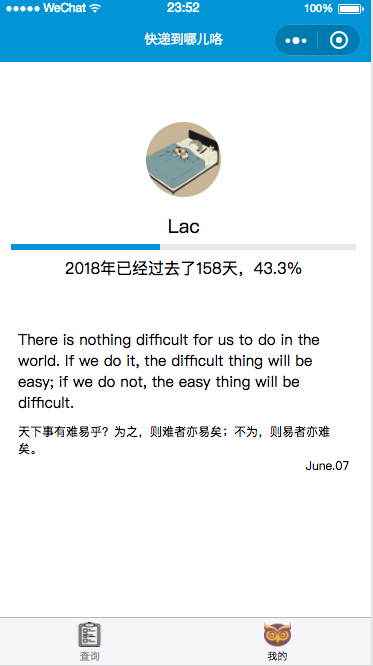
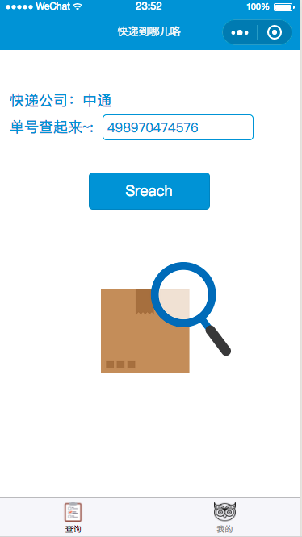
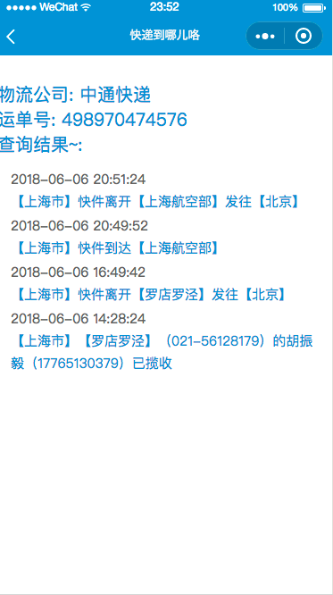

# your-express-mpvue

> A Mpvue project (快递到哪儿咯)

## pics






## Api

快递： https://github.com/jokermonn/-Api/blob/master/ExpressDelivery.md

每日一句： https://open.iciba.com/dsapi/


## Build Setup

``` bash
# install dependencies
npm install

# serve with hot reload at localhost:8080
npm run dev

# build for production with minification
npm run build

```

todolist
- 查询历史记录
- Make Beautiful
- 加引导
- icommon font


Just for fun!